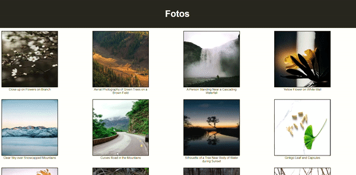

<h1 align="center">
  Fotos Pexels
</h1>

- - -

<h1>Preview</h1>

  

 

## Tecnologias

 Esse projeto foi desenvolvido com as seguintes tecnologias:

- HTML
- SASS
- REACT 
- TYPESCRIPT

## Projeto

 Para executar esse projeto basta usar os comandos no terminal:
 - yarn 
 - yarn dev

 Nesse projeto estou consumindo a API do Pexels, onde pode ser encontrado no site [clique aqui](https://www.pexels.com/pt-br/api/documentation/). E depois rendenrizo em tela as cartas com o nome da imagem e a foto que foi tirada pelo fotográfo.

 - - - 

 Projeto desenvolvido por Enan Dorta.